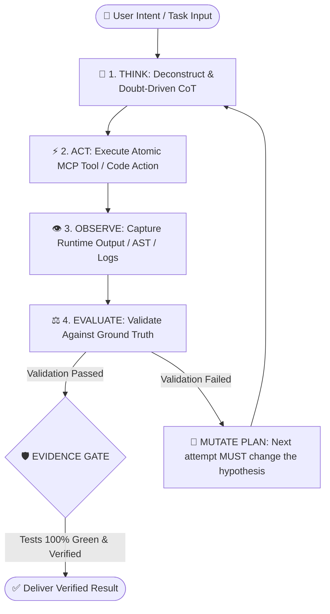

# 🏛️ Enterprise Agentic AI Hub & Multi-Agent Architecture

[](LICENSE)
[](#-deterministic-loop-engineering-framework)
[](#-enterprise-gold-audit-certification-100100)
[](#-curated-modular-domain-blueprints)
[](#-curated-modular-domain-blueprints)
[](#-curated-modular-domain-blueprints)
[](#-privacy-zero-leakage--safety-guarantee)
[](https://www.linkedin.com/in/juan-rodriguez-dev-ai)

> **Enterprise Multi-Agent Framework (2026)**  
> **Author:** Juan Armando Rodríguez Pérez — *Applied AI & Full-Stack Systems Engineer*  
> **Architecture Repository:** [https://github.com/dyviarlp/agentic-ai-hub](https://github.com/dyviarlp/agentic-ai-hub)

---

## 🧭 Overview

The **Enterprise Agentic AI Hub** is a curated catalog of **production-grade AI Agent Blueprints** designed for high-stakes software engineering, cloud infrastructure, career branding, and AI safety auditing. 

Unlike generic prompt templates, these blueprints are engineered around **Formal State Machine Loops**, **Native MCP (Model Context Protocol) Integration**, **Zero-Click Dynamic Intent Routing**, **Doubt-Driven Chain-of-Thought (CoT)**, and **Shift-Left Automated Quality Assurance**.

---

## 🔄 Deterministic Loop-Engineering Framework

Every agent operating within this framework executes under an immutable state machine designed to prevent infinite loops, hallucinated resolutions, and blind retry patterns:



### ⚡ The Immutable Engineering Principle
> **"The next attempt MUST change the plan."**  
> If a test, build, or evaluation fails, the agent is strictly prohibited from repeating the same action or assuming transient behavior without introducing a new structural hypothesis or root-cause patch.

---

## 🏆 Enterprise Gold Audit Certification (100/100)

The entire template repository has been subjected to formal cross-project red-teaming and compliance auditing, certified as **100% Enterprise Gold**:

* **Declarative RFC 8259 Manifests:** 100% compliant `project_manifest.json` across all domains in pure UTF-8 (zero BOM).
* **Zero Ghost Skills:** 17 of 17 skills physically materialized with production code, schemas, and execution rules in `.agents/skills/`.
* **Zero Secrets & Zero Leakage:** Strict `.gitignore` boundaries, sanitized examples, and zero hardcoded credentials.
* **Ground Truth Consistency:** Verified test suites (100% pass rate), cross-framework compatibility (Dart 3.5+, React 19, Python 3.12+), and official production metrics.

---

## 📦 Curated Modular Domain Blueprints

This repository hosts 4 specialized, sanitized, privacy-clean agent templates ready for drop-in use:

| Blueprint | Domain & Core Stack | Native MCP Servers | Elite Physical Skills Active | Key Capabilities |
| :--- | :--- | :--- | :--- | :--- |
| [**`01_Template_Mobile_Flutter`**](./01_Template_Mobile_Flutter) | Flutter 3.5+, Riverpod 3.x, Android API 34–37, Firebase | `firebase`, `google_maps_platform`, `flutter/dart`, `github` | `pocock-safety`, `ponytail`, `karpathy-discipline` | Decoupled Manifest (`project_manifest.json`), 5 RAG Memory Domains, Reactive 360° Loop, Clean Architecture |
| [**`02_Template_Web_Fullstack`**](./02_Template_Web_Fullstack) | Next.js, React 19, TypeScript, Astro, Vercel Serverless | `chrome-devtools`, `modern-web-guidance`, `visualization`, `github` | `chrome-devtools`, `gsap-motion`, `modern-web-guidance`, `react-best-practices`, `taste-skill`, `typescript-safety`, `ui-ux-pro-max` | Author-Grade UI/UX, 5 RAG Memory Domains, Core Web Vitals (LCP < 2s, INP < 200ms), WCAG AA a11y, Strict TS API Contracts |
| [**`03_Template_Career_HR`**](./03_Template_Career_HR) | Playwright Headless PDF, ATS Parser, Python, LinkedIn Sync | `playwright/python`, `web-search/url-reader`, `github` | `anthropic-skills`, `cv-ats-optimizer`, `humanizer`, `marketingskills` | Decoupled Manifest (`project_manifest.json`), 4 RAG Memory Domains, Deterministic 2-page A4 PDF rendering, strict NDA compliance, 360° Profile Synchronization |
| [**`04_Template_AI_Safety_Evals`**](./04_Template_AI_Safety_Evals) | Python Evals, Prompt Injection Testing, OWASP MASVS | `filesystem/search`, `evaluation-tools`, `github` | `red-teaming-guardrails`, `security-and-hardening`, `truthfulness-evaluator` | Red-teaming batteries, 5 RAG Memory Domains, jailbreak probing, anti-hallucination auditing, granular Firestore & Cloud Rules hardening |

---

## 📂 Repository Structure

```text
agentic-ai-hub/
├── 01_Template_Mobile_Flutter/
│   ├── .agents/
│   │   ├── memory/                    # 5 RAG Memory Domains (Logic, UI, State, Data, Governance)
│   │   ├── skills/                    # karpathy-discipline, pocock-safety, ponytail
│   │   ├── AGENTS.md                  # Mobile Flutter agent instructions & constraints
│   │   ├── error_learned.md           # Learned mitigations & forensic anti-patterns
│   │   └── project_manifest.json      # Decoupled project contract & commands
│   └── README.md                      # Architecture deep dive & Flutter QA blueprint
│
├── 02_Template_Web_Fullstack/
│   ├── .agents/
│   │   ├── memory/                    # 5 RAG Memory Domains (CWV, UI/UX, TS Contracts, SEO, CI/CD)
│   │   ├── skills/                    # 7 physical skills (React best practices, GSAP, DevTools...)
│   │   ├── AGENTS.md                  # Fullstack Web agent rules & Web Vitals directives
│   │   └── project_manifest.json      # Web build & verification contract
│   └── README.md                      # Next.js/React & Serverless guidelines
│
├── 03_Template_Career_HR/
│   ├── .agents/
│   │   ├── memory/                    # 4 RAG Memory Domains (ATS, Playwright, NDA, Cross-Audit)
│   │   ├── skills/                    # anthropic-skills, cv-ats-optimizer, humanizer, marketingskills
│   │   ├── AGENTS.md                  # Tech recruiter & career strategy agent instructions
│   │   ├── error_learned.md           # ATS & PDF formatting learnings
│   │   └── project_manifest.json      # Career ecosystem manifest
│   └── README.md                      # Headless Playwright PDF & ATS optimization manual
│
├── 04_Template_AI_Safety_Evals/
│   ├── .agents/
│   │   ├── memory/                    # 5 RAG Memory Domains (Vulns, Mitigations, LLM Benchmarks...)
│   │   ├── skills/                    # red-teaming-guardrails, security-and-hardening, truthfulness-evaluator
│   │   ├── AGENTS.md                  # AI safety, red teaming & security audit directives
│   │   └── project_manifest.json      # Safety evals runner contract
│   └── README.md                      # Guardrail evaluation & MASVS compliance guide
│
├── .gitignore
├── LICENSE
└── README.md                          # Master Hub Documentation (This file)
```

---

## 🚀 Quickstart: Integrating Blueprints into Your Project

Adopting any blueprint in your target project takes **one command**. The agentic IDE (Antigravity IDE, Claude Code, Cursor, Windsurf, Gemini CLI, Cline) will immediately discover `.agents/AGENTS.md` at the workspace root:

### 1. Flutter Mobile Project
```bash
cp -r 01_Template_Mobile_Flutter/.agents /path/to/your-flutter-project/
```

### 2. Web Fullstack Project
```bash
cp -r 02_Template_Web_Fullstack/.agents /path/to/your-web-project/
```

### 3. Career & Document Strategy
```bash
cp -r 03_Template_Career_HR/.agents /path/to/your-career-workspace/
```

### 4. AI Safety & Security Evals
```bash
cp -r 04_Template_AI_Safety_Evals/.agents /path/to/your-audit-workspace/
```

---

## 🛡️ Privacy, Zero-Leakage & Safety Guarantee

All templates in this hub are **100% sanitized and virgin**:
- ❌ **Zero Hardcoded Secrets / API Keys:** All environments require dynamic `.env` configuration.
- ❌ **Zero Private Telemetry:** No personal identifiable information (PII) or confidential client data.
- ✅ **Strict NDA Compliance:** Frameworks focus strictly on engineering architecture and public evaluation standards.

---

## 👤 Author & Connect

**Juan Armando Rodríguez Pérez**  
*Applied AI & Full-Stack Systems Engineer*  
*Specialized in Fault-Tolerant Mobile/Web Platforms, Agentic AI Systems & Algorithmic Safety.*

- 💼 **LinkedIn:** [linkedin.com/in/juan-rodriguez-dev-ai](https://www.linkedin.com/in/juan-rodriguez-dev-ai)
- 🌐 **Live Production Showcase:** [mascotia-app.web.app](https://mascotia-app.web.app)
- 🐙 **GitHub Profile:** [github.com/dyviarlp](https://github.com/dyviarlp)

---

## 📄 License

This project is licensed under the [MIT License](LICENSE) — feel free to use and adapt it for personal or commercial agentic systems with attribution.
